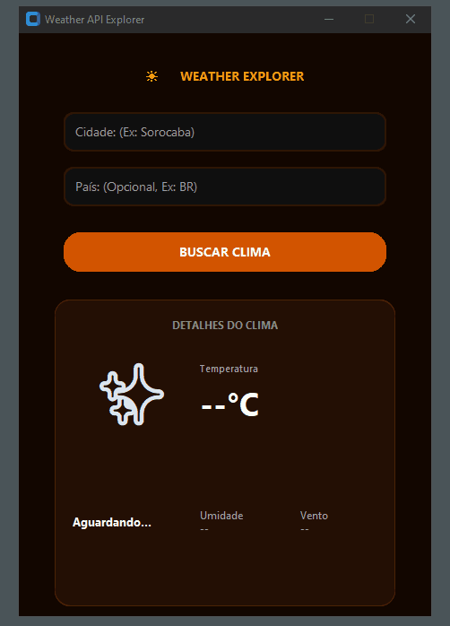

# ☀️ WeatherAPI Explorer

O **WeatherAPI Explorer** é uma aplicação desktop moderna desenvolvida em Python para busca e consulta de informações climáticas detalhadas em tempo real através da integração com a API do OpenWeatherMap.



## 🚀 Recursos
* Busca inteligente combinando o nome da cidade ou região.
* Interface gráfica otimizada com sistema centralizado para leitura fluida das condições meteorológicas atuais.
* Filtro automático que organiza os dados de temperatura, umidade e vento do servidor, entregando apenas os dados limpos.

## 🛠️ Tecnologias Utilizadas
* **Python**
* **CustomTkinter** (Interface Gráfica com estética Dark Mode)
* **Requests** (Biblioteca cliente para integração com a API)
* **Python-dotenv** (Gerenciamento seguro de credenciais locais)

---

## 🔒 Configuração de Segurança e Credenciais

O projeto foi construído seguindo boas práticas de segurança, mantendo os tokens de acesso isolados do código-fonte público.

1. Crie uma conta gratuita no portal de desenvolvedores do [OpenWeatherMap](https://openweathermap.org/api).
2. Gere uma *API Key* gratuita.
3. Na raiz do projeto, duplique o arquivo `.env.example`, renomeie para `.env` e adicione o seu token:

```text
WEATHER_TOKEN=sua_chave_aqui
